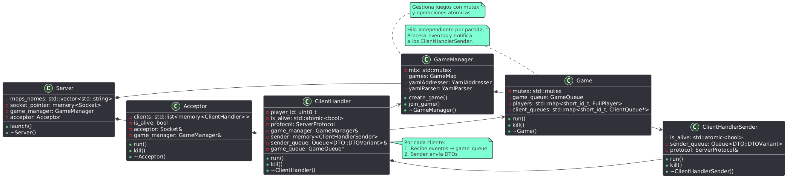
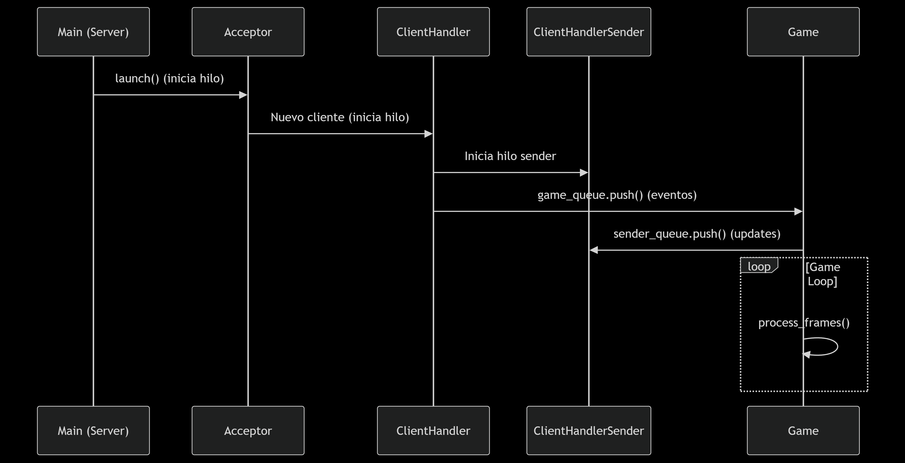
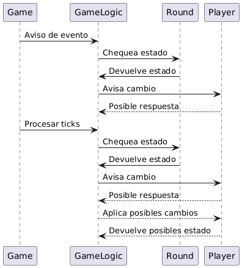
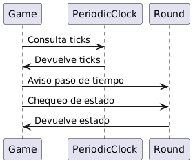
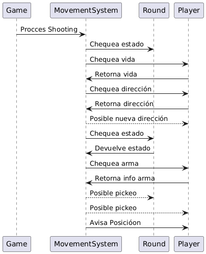
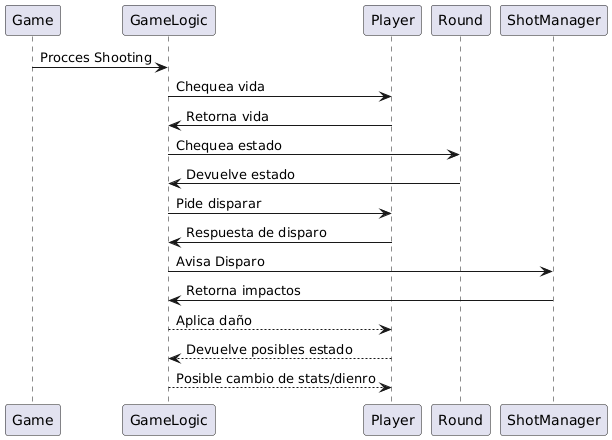
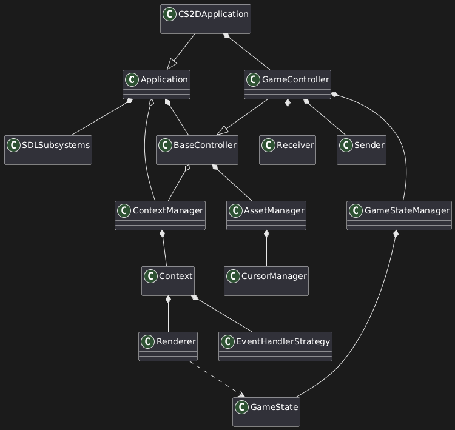
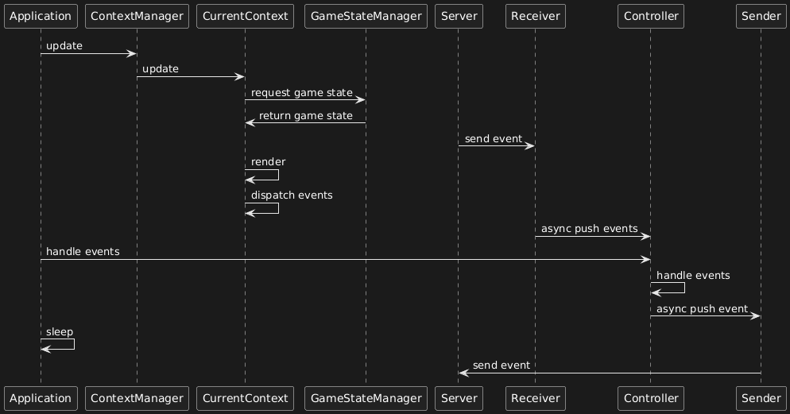

# Documentación Técnica - Counter Strike 2D

Este documento describe la arquitectura y estructura técnica del proyecto Counter Strike 2D.

## Índice

- [Arquitectura del Servidor](#arquitectura-del-servidor)
- [Componentes Principales del Servidor](#componentes-principales-del-servidor)
- [Colas de Comunicación](#colas-de-comunicación)
- [Configuración](#configuración)
- [Manejo de Errores](#manejo-de-errores)

## Arquitectura del Servidor

### Estructura de Clases en el Servidor

### Estructura de Hilos en el Servidor

## Componentes Principales del Servidor

### 1. Server (Hilo Principal)

**Responsabilidad**: Punto de entrada del servidor, inicialización y gestión del ciclo de vida

**Funciones principales**:

- Carga de mapas disponibles desde el directorio `maps/`
- Creación del socket de escucha
- Inicialización del `GameManager` y `Acceptor`
- Control del ciclo de vida del servidor

### 2. Acceptor (Hilo de Aceptación)

**Responsabilidad**: Aceptar nuevas conexiones de clientes

**Funciones principales**:

- Escucha en el socket principal para nuevas conexiones
- Crea instancias de `ClientHandler` para cada cliente conectado
- Gestiona la limpieza de clientes desconectados
- Mantiene una lista de clientes activos

### 3. ClientHandler (Hilo por Cliente)

**Responsabilidad**: Manejo de comunicación con un cliente específico

**Funciones principales**:

- Recepción y procesamiento de eventos del cliente
- Gestión de eventos de lobby (crear/unión de juegos, listar juegos)
- Delegación de eventos de juego al `GameManager`
- Coordinación con `ClientHandlerSender`

### 4. ClientHandlerSender (Hilo de Envío)

**Responsabilidad**: Envío de datos al cliente

**Funciones principales**:

- Procesamiento de cola de mensajes para envío
- Serialización y envío de DTOs al cliente
- Manejo de errores de comunicación

### 5. GameManager (Gestor de Juegos)

**Responsabilidad**: Administración centralizada de todas las partidas

**Funciones principales**:

- Creación y destrucción de juegos
- Gestión del ciclo de vida de las partidas
- Asignación de jugadores a juegos
- Limpieza de juegos terminados

### 6. Game (Hilo de Juego)

**Responsabilidad**: Lógica de una partida específica

La clase **Game** depende de **GameLogic** para aplicar la lógica del modelo, y de
la clase **MovementSystem** para procesar movimientos. Esto sucded durante la ejecución de
cada *frame*

**Funciones principales**:

- Procesamiento de eventos de jugadores
- Actualización del estado del juego
- Broadcast del estado a todos los jugadores
- Gestión de rondas y lógica de juego

## Colas de Comunicación

| Cola | Tipo | Descripción |
|------|------|-------------|
| **GameQueue** | `Queue<std::pair<uint8_t, GameEventVariant>>` | Cola de eventos de juego (player_id + GameEventVariant) |
| **SenderQueue** | `Queue<DTO::DTOVariant>` | Cola interna del ClientHandlerSender para enviar los datos al cliente |

## Configuración

### Archivos de Configuración

- **`game_config.yaml`**: Configuración general del juego
  - Parámetros de juego (rondas, tiempo, dinero)
  - Configuración de armas y jugadores
  - Configuración de pantalla y FOV
- **`maps/`**: Archivos YAML con definición de mapas
- **`assets/`**: Recursos gráficos y de sonido

## Manejo de Errores

### Excepciones Específicas

| Excepción | Descripción | Cuándo se lanza |
|-----------|-------------|-----------------|
| **InvalidGameException** | Juego no válido o inexistente | Al intentar unirse a un juego inválido |
| **InvalidPlayerException** | Jugador no válido | Al procesar eventos de jugador inexistente |
| **ClosedQueue** | Cola cerrada | Cliente desconectado |
| **std::exception** | Errores de comunicación de red | Problemas de socket |

### Estrategias de Performance

- **Reap de juegos**: Limpieza automática de juegos terminados
- **Reap de clientes**: Eliminación de clientes desconectados

## Arquitectura del cliente

Esta es una representación simplificada de la arquitectura del cliente en un diagrama de clases.

El siguiente representa el flujo de la aplicación por cada frame de ejecución.

El cliente está construido usando el patrón de arquitectura **MVC**, donde un controlador
central organiza el acceso al modelo para las demás clases. Se modela una Single Window
Application (SWA), lo que permite permitir un único punto de acceso al manejo de eventos
y a los recursos del modelo.

Está construido con un sistema de *contextos*, donde cada contexto es una instancia de
una clase que es capaz de renderizar el estado actual del juego en una ventana de SDL2 y
pre procesar eventos para despacharlos al controlador central. El estado del juego es
administrado y provisto (a modo de *snapshots*) por un GameManager, que también registra
eventos enviados por el servidor a través de flags específicas.

El controlador lanza un hilo secundario para popear eventos de una cola de eventos asincrónica,
e instancia un **Receiver** y un **Sender**, que también administran sus hilos secundarios para
recibir eventos del servidor y enviarlos, respectivamente.
